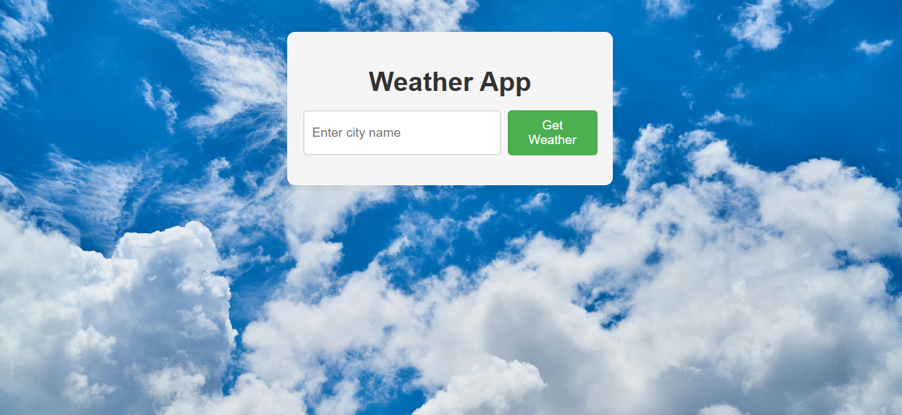
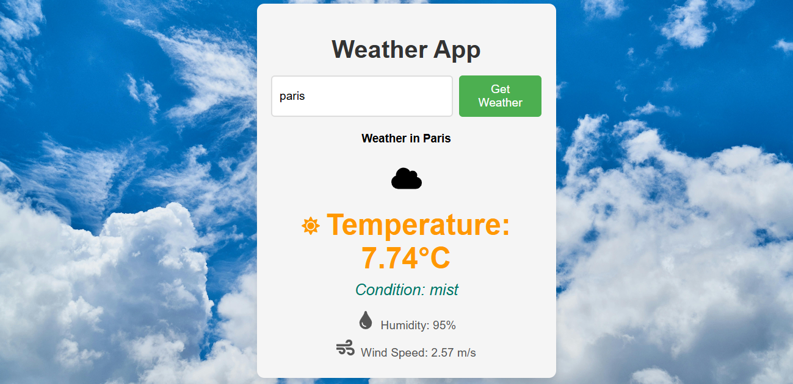

# Weather App 🌤️

A full-stack Weather App that uses **React** for the frontend and **Django with Django REST Framework (DRF)** for the backend to display real-time weather information.

## 📚 **Project Overview**

This app allows users to:

- Search for the weather in any city.
- View current temperature, humidity, and weather conditions.
- Experience a responsive design optimized for both mobile and desktop.

The backend serves the weather data via an API, while the frontend consumes this API to display the data.

---

## 🚀 **Features**

### Frontend (React)
- Interactive UI to search and display weather data.
- Responsive design.
- Fetches data from the Django REST API.

### Backend (Django + DRF)
- RESTful API endpoints to provide weather data.
- Secure handling of API keys.

---

## 🛠️ **Technologies Used**

### **Frontend:**
- **React** (JavaScript library for building user interfaces)
- **CSS** (for styling)

### **Backend:**
- **Django** (Python web framework)
- **Django REST Framework (DRF)** (for building APIs)

### **API:**
- **OpenWeatherMap API** 

---

## 📸 **Screenshots**

---

